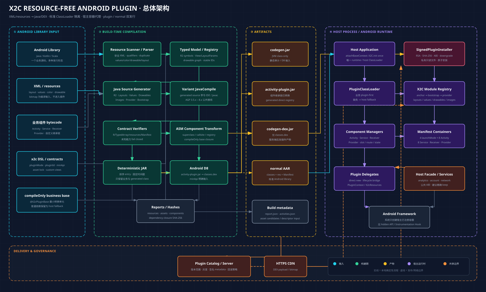
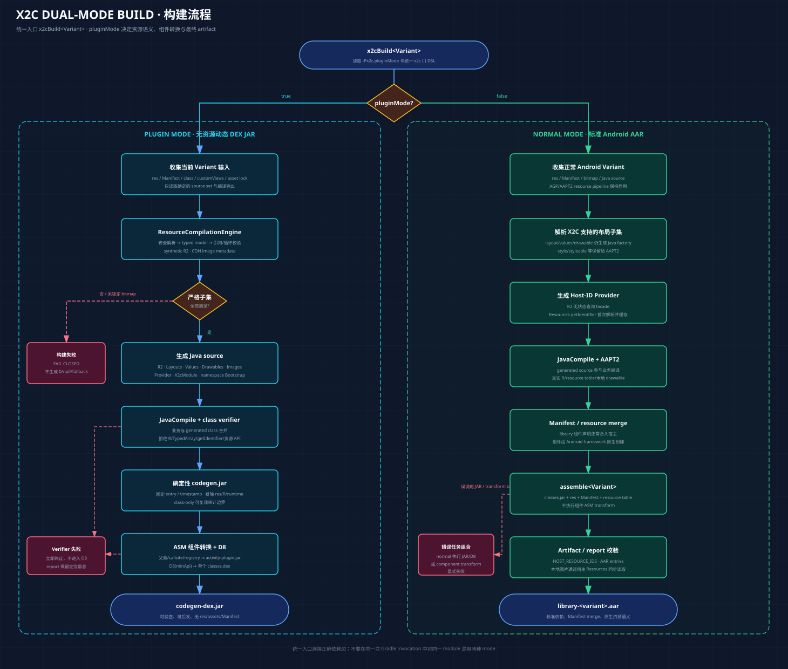
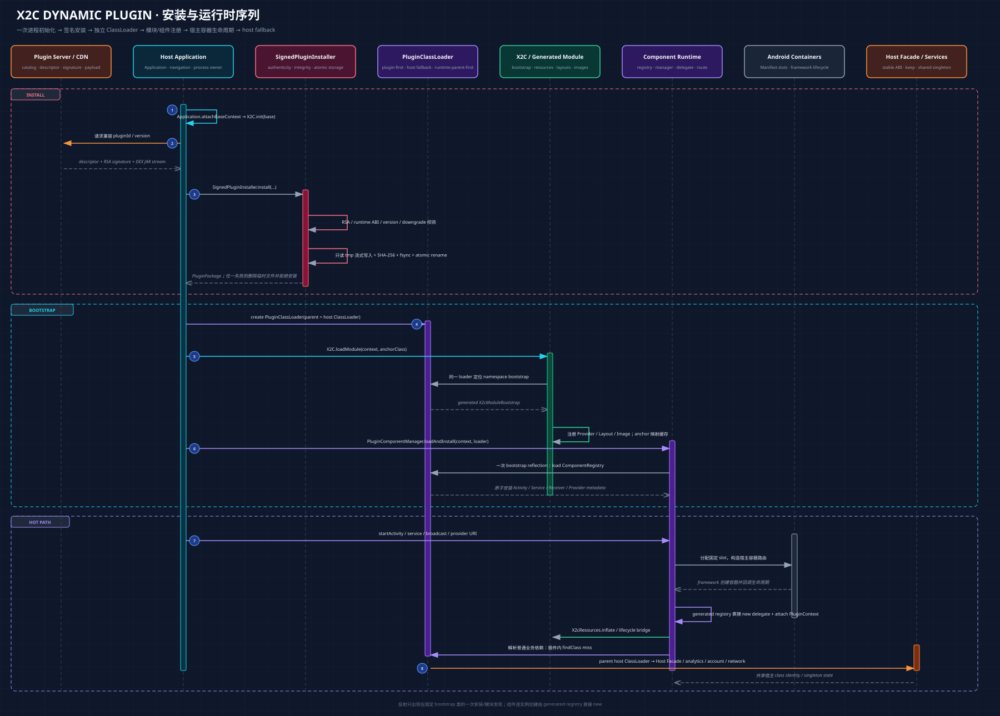

# X2C 整体架构与完整设计

> 文档状态：As-built architecture + production roadmap
>
> 基线版本：`0.1.0-SNAPSHOT`
>
> 更新日期：2026-09-08

本文描述当前仓库已经实现的资源转 class、双模式构建、动态 DEX JAR、安全安装、ClassLoader、Android 四大组件代理与示例验证架构。标记为“规划”的内容尚未实现，不能作为当前运行时承诺。

## 1. 设计目标

X2C 的核心目标不是复刻完整 Android resource table，而是在一个明确、可验证的能力边界内，将 Android library 转换为可独立加载的 class/DEX，并同时保留标准 AAR 集成能力。

主要目标：

- 将多个 `res/layout/*.xml` 编译为类型化 Java View 构建代码；
- 将受支持的 values、color 和 drawable 编译为 Java provider；
- plugin 模式最终只交付 `classes.dex`，不包含 `res/`、resource table、assets 或 Manifest；
- normal 模式生成标准 AAR，保留 Android 原生资源、Manifest merge 和组件创建语义；
- 动态插件通过标准 `DexClassLoader` 加载，不 Hook `ActivityThread`、`Instrumentation` 或隐藏字段；
- 构建期转换 Activity、Service、BroadcastReceiver、ContentProvider，并生成直接构造 registry；
- 平台/X2C runtime 父优先，普通业务类插件优先且在缺失时回退宿主 ClassLoader；
- 未支持的资源或组件语义在构建期明确失败，不生成静默降级代码；
- 支持 AGP 3.5.x–8.x 的同一套公共构建接线。

非目标：

- 不承诺对任意 Android XML、theme、styleable 或 resource qualifier 无损兼容；
- 不将动态 JAR 伪装成 PackageManager 已安装 APK；
- 不通过 ClassLoader 提供恶意代码安全沙箱；
- 当前不支持插件热卸载、同进程替换或进程死亡后的完整组件恢复；
- 当前不支持 AppCompat/Fragment/Material 完整继承与资源语义。

## 2. 架构总览



[查看 @2x PNG](../diagram/x2c-architecture/overall-architecture@2x.png)

系统由四个主要边界组成：

1. Android library 输入：业务 bytecode、XML/resources、Manifest、构建 DSL、asset lock 与自定义 View contract；
2. 构建期编译：资源 parser/model/generator、class/Manifest verifier、ASM 组件转换、确定性 JAR 与 D8；
3. 发布产物：plugin 模式 DEX JAR 或 normal 模式 AAR，以及可审计报告；
4. 宿主运行时：一次性 X2C 初始化、安全安装、ClassLoader、资源模块、组件 manager、Manifest 容器和宿主业务服务。

外部的插件目录服务和 CDN 负责版本选择、灰度及文件分发，但客户端仍负责最终的签名、摘要、ABI 和防降级校验。

## 3. 模块职责与依赖

### 3.1 构建期模块

| Module | 产物/Plugin ID | 职责 |
|---|---|---|
| `x2c-gradle-plugin` | `dev.x2c.codegen` | 注册 variant 任务、资源转 Java、generated source 接线、确定性 class JAR、D8 JAR |
| `x2c-gradle-plugin/activity-compiler` | Java library | ASM 组件继承链与 callsite 转换、compileOnly base 选择、direct registry 生成 |
| `x2c-gradle-plugin/activity-gradle-plugin` | `dev.x2c.activity-plugin` | 将组件转换插入 `codegen.jar` 与 D8 之间，采集 runtime/compileOnly 依赖 |

构建插件生产 class major 52 的 Java 8 bytecode。生产代码只使用 AGP 3.5.x 到 8.x 共同存在的 legacy public Variant API，避免在旧 AGP 中加载新 API class 时发生 `NoClassDefFoundError`。

### 3.2 宿主运行时模块

| Module | 宿主归属 | 职责 |
|---|---|---|
| `x2c-runtime` | 唯一 `implementation` | `X2C` 初始化与模块注册、`X2cResources`、图片 SPI、`PluginClassLoader` |
| `x2c-plugin-api` | 宿主持有；插件/业务 base 使用 `compileOnly` | 四类组件 annotation、metadata、launchMode 和 registry contract |
| `x2c-plugin-base` | 宿主 `implementation` | 四类插件 delegate 公共根；禁止打入插件 payload |
| `x2c-plugin-loader` | 宿主 `implementation` | descriptor、RSA 验签、SHA-256、防降级、私有文件安装与 ClassLoader 创建 |
| `x2c-plugin-runtime` | 宿主 `implementation` | 四大组件 manager、PluginContext、宿主 Manifest 容器、Intent/URI 路由 |

### 3.3 Fixture 模块

| Module | 用途 |
|---|---|
| `fixtures/business-base` | 同一业务 BaseActivity 在宿主保持 `Activity` 根、在插件复制后转换为 `PluginActivity`；analytics 验证宿主 fallback |
| `fixtures/producer` | 完整 layout/resources/image/JVM 语义示例，也支持 plugin/normal 双模式构建 |
| `fixtures/producer-secondary` | 四种 Activity launchMode 与 Service/Receiver/Provider 示例 |
| `fixtures/consumer` | 两个独立 PluginClassLoader、签名安装、组件路由与跨插件测试宿主 |
| `fixtures/normal-library` | 标准 AAR 基线 |
| `fixtures/normal-app` | normal library 原生 Manifest/Resources/Activity 集成验证 |

## 4. 双模式构建



[查看 @2x PNG](../diagram/x2c-architecture/build-flow@2x.png)

统一任务入口为：

```bash
./gradlew :library:x2cBuildRelease -Px2c.pluginMode=true
./gradlew :library:x2cBuildRelease -Px2c.pluginMode=false
```

或者使用带产物结构校验的 wrapper：

```bash
./scripts/build-x2c-artifact.sh --module :library --mode plugin --variant release
./scripts/build-x2c-artifact.sh --module :library --mode normal --variant release
```

### 4.1 共同输入

每个 variant 的输入包括：

- variant source sets 中的资源目录；
- library Manifest；
- Java/Kotlin/Scala 编译输出；
- `x2c.pluginMode`、`pluginId`、`generatedPackage` 和 `minApi`；
- 可选 `x2c-assets.lock.json`；
- 可选 `x2c-custom-views.json`；
- runtime 依赖与 compileOnly 业务 BaseActivity 输入。

`x2cGenerate<Variant>` 输出到 `build/generated/java/x2cGenerate<Variant>/`，并通过 `registerJavaGeneratingTask`、`JavaCompile.source` 和 `dependsOn` 同时接入 IDE model 与真实编译边。

### 4.2 pluginMode=true

plugin 模式执行严格资源编译：

```text
resource scan
  → secure XML parse
  → typed resource model
  → reference/cycle/duplicate validation
  → Java source generation
  → JavaCompile
  → class/Manifest contract verification
  → deterministic codegen.jar
  → ASM component transform
  → activity-plugin.jar
  → D8
  → codegen-dex.jar
```

最终 `codegen-dex.jar` 只能包含一个 `classes.dex`。它不能包含：

- `res/` 或 `resources.arsc`；
- Android Manifest；
- bitmap 原文件；
- native library、Java resources 或 assets；
- `android.R` 之外的业务 `R/R$*`；
- 宿主 X2C runtime/API/base/loader 的副本。

### 4.3 pluginMode=false

normal 模式保留 AGP/AAPT2 资源流水线：

- X2C 仍为受支持的 layout 生成 Java factory；
- resource ID 来自宿主最终 resource table；
- bitmap 保留在 AAR 并通过宿主 `Resources` 读取；
- style/styleable 等 X2C 不建模的声明保留给 AAPT2；
- Manifest 正常 merge，组件由 Android framework 原生创建；
- 不执行组件 superclass transform，不允许输出脱离 resource table 的动态 JAR。

### 4.4 产物定义

| Artifact | 内容 | 角色 |
|---|---|---|
| `codegen.jar` | JVM `.class` | 构建中间物、静态审计和 D8 输入 |
| `activity-plugin.jar` | 已完成组件转换的 JVM `.class` | 最终 D8 输入、组件审计边界 |
| `codegen-dex.jar` | 单个 `classes.dex` | Android 动态加载发布物 |
| `*.aar` | class、res、Manifest 和资源表 | normal 模式标准 Android library |
| `report.json` | 资源模式、符号、布局、asset 等 | 构建审计 |
| `activities.json` | 组件、依赖闭包、ownership、digest | 组件审计和 descriptor 输入 |

### 4.5 确定性与配置缓存

- JAR entry 固定排序、固定 timestamp；
- 输入和输出通过 Gradle Property/File API 声明；
- task action 不访问 `Task.project`；
- `pluginMode` 是 task input，切换不依赖手工删除 generated 目录；
- `x2cBuild<Variant>` 在配置期选择 DEX JAR 或 AAR 依赖边；
- 当前已验证 configuration cache 存储与复用。

## 5. 资源编译器设计

### 5.1 分层

| 层 | 核心类 | 规则 |
|---|---|---|
| orchestration | `ResourceCompilationEngine` | 只控制扫描、解析、校验、生成、报告顺序 |
| discovery/model | `ResourceScanner`、`ResourceModel`、`ResourceSymbols`、`SyntheticIdAllocator` | 确定性输入、符号全集与稳定 ID |
| parser | `ValuesResourceParser`、`ColorResourceParser`、`DrawableResourceParser`、`LayoutResourceParser` | XML 到 model，不直接生成源码 |
| registry | `FrameworkViewRegistry`、`CustomViewRegistry` | View、属性、构造器与 LayoutParams contract 单一事实源 |
| generator | `*SourceGenerator`、`LayoutEmitter` | model 到 Java，不重新读取 XML |
| infrastructure | `XmlSupport`、`ResourceValueParser`、`JavaExpressions`、`FileSupport` | 安全 XML、typed value、Java 表达式与摘要 |
| report/lock | `CompilationReportWriter`、`AssetLockVerifier` | 报告与不可变 bitmap metadata 边界 |

新增资源类型时必须先扩展 model，再独立扩展 parser 和 generator；parser 不写 Java，generator 不读 XML。

### 5.2 Generated 类型

生成包中包含实现细节类型，例如：

- `R2`：完整受支持资源 namespace；
- `X2cLayouts`：每个 layout 对应独立 factory；
- `X2cValues`、`X2cColors`、`X2cDrawables`、`X2cImages`；
- `X2cResourceProviderImpl`；
- `X2cModule`：模块内一次性初始化和注册；
- `<android namespace>.x2c.X2cModuleBootstrap`：业务 anchor 自动发现入口。

业务代码不应直接依赖 generated 实现类。推荐入口：

```java
X2cResources resources = X2C.resources(MyActivity.class);
resources.setContentView(this, "activity_login");
TextView title = resources.requireView(root, "title", TextView.class);
```

### 5.3 R2 与资源 ID

| 模式 | R2 语义 | 约束 |
|---|---|---|
| plugin | `public static final int` synthetic ID | 与宿主 resource table 无关；不能传给宿主 `Resources.getString/getDrawable` |
| normal | `R2.<type>.<name>(context)` 无状态查询 facade | Provider 按名称解析真实宿主 ID 并缓存；不能用于 `switch case`/annotation |

项目不再生成重复的 `X2cIds`，也没有 `R2.init()`。模块 Provider 是 normal ID 解析的唯一入口。

### 5.4 多 layout 与 inflate

所有 `res/layout/*.xml` 分别生成 factory，并注册到对应 module。运行时提供：

- `X2cResources.setContentView(Activity, layoutName)`；
- `getView(Context, layoutName)`；
- `inflate(Context, layoutName, parent)`；
- `inflate(Context, layoutName, parent, attachToRoot)`。

生成器遵循 Android inflate 的关键结构顺序：

```text
构造当前节点
  → 应用普通属性
  → 创建父容器要求的 LayoutParams
  → 递归创建并 attach children
  → 调用 children-finished hook
  → attach 到外层 parent
```

### 5.5 View/ViewGroup 支持

framework 静态 child 容器包括：

- `LinearLayout`、`FrameLayout`、`RelativeLayout`；
- `GridLayout`、`TableLayout/TableRow`、`RadioGroup`；
- `ScrollView`、`HorizontalScrollView`；
- ViewAnimator 家族；
- `Toolbar`、`ActionMenuView` 及常见 framework 复合容器。

生成真实的 Linear/Frame/Relative/Grid/Table/Radio/Toolbar LayoutParams，包括 Relative rules、Grid spec、TableRow column/span 等。

`ListView`、`GridView`、`Spinner` 等 AdapterView 的 child 由 adapter 管理，因此作为 XML 静态父节点会构建失败。

通用 View 属性覆盖：

- ID、宽高、weight、gravity、margin、padding；
- background/tint/foreground；
- visibility、enabled、click/focus/state；
- content description、tag、tooltip、transition；
- alpha、elevation、rotation、scale、translation、min size；
- layout direction、over-scroll 和常用 accessibility 属性；
- TextView/ImageView/CompoundButton/ProgressBar/SeekBar/RatingBar 常用 typed setter。

### 5.6 自定义 View contract

自定义 View 使用静态 JSON contract，而不是运行时反射猜测：

- 构造策略：`CONTEXT`、`CONTEXT_ATTRS`、`CONTEXT_ATTRS_DEF_STYLE`；
- `<view class="...">` 和全限定 tag；
- 属性通过类型化 setter 或 public field；
- ViewGroup 可声明 container、自定义 LayoutParams、静态 factory；
- 支持 `MarginLayoutParams`、父专属 `layout_*` setter/field；
- 支持 public children-finished hook。

`CONTEXT_ATTRS` 当前传入 `(context, null)`，三参数构造传入 `(context, null, 0)`；它只选择构造函数，不能模拟真实 `AttributeSet`、theme 或 styleable 解析。

### 5.7 Values / color / drawable

当前 plugin 子集：

- values：string、literal color、bool、integer、dimen、fraction、string/integer/typed array、plurals 数据、`item type=id`；
- `res/color` selector：状态集合、alpha、default-last；
- shape：rectangle/oval/line/ring、solid/gradient/corners/stroke/size/padding；
- composition：selector、layer-list、inset、clip、scale、rotate、level-list；
- drawable 引用执行未知引用、循环依赖和异步 bitmap 混用检查。

当前 plugin 模式明确拒绝 qualifier、style/theme/styleable、vector、ripple、nine-patch、animated drawable、include/merge、Data/View Binding、资源 overlay 和动态资源名。

### 5.8 图片模型

plugin 模式：

```text
本地 bitmap 候选
  → 独立上传流程
  → 不可变 asset lock（HTTPS URL / MIME / bytes / SHA-256 / dimensions）
  → Java ImageAsset metadata
  → 宿主 ImageLoader 异步加载
```

Gradle 插件只消费 lock，不读取上传凭据、不主动访问网络。最终 JAR 不含图片原文件。

normal 模式保留 bitmap，由宿主 `Resources` 同步解析为 Drawable。双模式自定义 View 可以为同名 setter 分别提供 `ImageAsset` 和 `Drawable` overload。

## 6. 动态插件运行时



[查看 @2x PNG](../diagram/x2c-architecture/runtime-sequence@2x.png)

### 6.1 进程初始化

宿主在 `Application.attachBaseContext` 调用一次：

```java
X2C.init(baseContext);
```

`X2C` 保存 application Context、宿主 package name 和宿主 ClassLoader，并通过 volatile 快路径与同步锁保证只发布一次。loader、generated module、组件或资源访问只调用 `requireInitialized`，不会重复绑定 Context。

### 6.2 Descriptor 与安全安装

当前 descriptor 是固定七行 canonical UTF-8：

```text
x2c-plugin-v2
pluginId
versionCode
versionName
runtimeAbiVersion
dependencyClosureSha256
payloadSha256
```

安装顺序：

1. 使用内置 publisher public key 验证 `SHA256withRSA` 签名；
2. 检查组件 runtime ABI 完全一致；
3. 拒绝低于已接受版本的 downgrade；
4. 拒绝相同 versionCode 对应不同 payload digest；
5. 在应用私有目录创建临时文件；
6. 写入任何动态代码前先将文件标记只读；
7. 流式写入、同步计算 SHA-256、`fsync`；
8. 摘要一致后原子 rename 为正式 payload；
9. 持久化最高已接受版本和 digest。

任一异常会删除临时文件并拒绝安装。安装器使用进程级锁串行化版本检查、文件替换和持久化。

### 6.3 ClassLoader 策略

`PluginClassLoader` 以宿主 ClassLoader 为 parent，但对业务类使用 plugin-first：

```text
loadClass(name)
  → 已加载缓存
  → 平台或 X2C runtime 包？
       是：parent-first
       否：findClass(plugin)
              → 命中：插件副本
              → miss：hostClassLoader.loadClass(name)
```

固定 parent-first 范围：

- Java/Android/Dalvik/XML 平台包；
- `dev.x2c.runtime.*`；
- `dev.x2c.plugin.api.*`；
- `dev.x2c.plugin.base.*`；
- `dev.x2c.plugin.runtime.*`；
- `dev.x2c.plugin.loader.*`。

普通业务类无需 `X2cHostApi`、注册或加载白名单。若同名业务 class 明确进入插件，插件副本优先；若插件不存在该 class，则自然使用宿主副本。

ClassLoader 只解决代码可见性和类型身份，不是权限沙箱。插件与宿主在同一 UID/进程中。

### 6.4 模块发现与注册

业务通过 anchor class 获取资源：

```java
X2cResources resources = X2C.resources(PluginActivityClass.class);
```

首次访问时：

1. 根据业务 class 包路径逐级定位 `<namespace>.x2c.X2cModuleBootstrap`；
2. 强制 bootstrap 和业务 anchor 来自同一个 ClassLoader；
3. 调用 generated `X2cModule.init(Context)`；
4. 注册 provider、layouts 和 images；
5. 缓存 anchor class 到 module name 的映射。

后续同 anchor 访问命中缓存。每个已加载 JAR 必须具有唯一 `generatedPackage/moduleName`，重复名称直接失败。

当前反射边界是“一次 bootstrap reflection”，不是任意业务组件热路径反射。

## 7. Android 组件插件化

### 7.1 构建期转换

业务源码仍可使用 framework 类型和正常 annotation：

- `@X2cPluginActivity`；
- `@X2cPluginService`；
- `@X2cPluginReceiver`；
- `@X2cPluginProvider`。

组件入口必须为 public、非抽象并具有 public 无参构造。编译器：

- 解析完整组件继承链；
- 将最底层 framework 根替换为插件 delegate 根；
- 改写已知 final API、ContentResolver 和组件路由 callsite；
- 生成固定类名的 `ComponentRegistry`；
- registry 内使用 switch 和直接 `new` 构造组件；
- 输出组件 metadata 和 dependency closure digest。

宿主安装时只对固定 registry class 做一次 bootstrap reflection；Activity/Service/Receiver/Provider 的逐实例创建不使用反射。

### 7.2 BaseActivity 与宿主依赖

同一业务 BaseActivity 的双身份：

```text
宿主：BusinessBaseActivity → android.app.Activity
插件：BusinessBaseActivity(plugin copy) → PluginActivity
```

插件以 `compileOnly(project(":business-base"))` 编译，并在需要转换的 Activity 根标注 `@X2cPluginBase`。编译器只复制：

- 被插件 Activity 真实继承的标注 base；
- Activity 父类链；
- 必须与 base 同 ClassLoader 的 nest/内部类；
- `include={...}` 明确指定的插件私有实现及其同 artifact 闭包。

字段、埋点、账户、网络等普通依赖不会自动进入 payload。插件 ClassLoader miss 后从宿主加载它们。因此：

- BaseActivity 的构造、字段初始化和 `super` 生命周期逻辑都会执行；
- BaseActivity 本身是插件私有 identity/static state；
- 未复制的宿主服务是全进程共享 identity/static state；
- 跨 ClassLoader 的类和成员必须可访问并保持二进制兼容。

这与 Shadow 的关键做法一致：转换插件侧 BaseActivity 副本，而不是修改宿主已经加载且仍以原生 Activity 为根的 class。

### 7.3 Activity

宿主 Manifest 预留四种 launchMode 各八个非导出容器。当前支持：

- standard、singleTop、singleTask、singleInstance；
- 构造、attach、完整常用生命周期和 Window/content bridge；
- 同插件、跨插件与插件到宿主导航；
- `startActivityForResult`/result；
- `onNewIntent`；
- slot 固定分配和 pluginId/component metadata 校验。

系统创建的永远是 Manifest 中的宿主容器，generated registry 直接构造逻辑插件 Activity，并由 runtime 转发生命周期。

### 7.4 Service

当前支持同进程普通 Service：

- start/stop、`stopSelf/stopSelfResult`；
- bind/unbind/rebind；
- `onCreate/onStartCommand/onTaskRemoved/onDestroy`；
- configuration/memory callbacks；
- 虚拟插件 ComponentName；
- 八个进程级 Service slot；
- 同 JAR 多层 BaseService 与 attachBaseContext。

只接受 `START_NOT_STICKY`。Sticky/Redeliver、特殊 framework Service、独立 process、permission 身份和任意 foregroundServiceType 不属于当前通用代理协议。

### 7.5 BroadcastReceiver

当前支持：

- 指向已安装插件 Receiver 的显式广播；
- normal/ordered broadcast；
- result code/data/extras、abort/clear；
- `goAsync()`；
- 每次广播由 generated registry 创建新实例。

不支持动态插件未加载时被系统 action 冷启动、动态 manifest intent-filter、exported receiver 或跨应用 permission 等价语义。

### 7.6 ContentProvider

每个插件 Provider 使用虚拟 authority，对外路由为：

```text
content://<applicationId>.x2c.plugin.provider/<pluginId>/<virtualAuthority>/...
```

插件业务继续使用原始 URI。构建器将支持的 ContentResolver callsite 改写为 `PluginContentResolver`，运行时只转换已安装插件 authority，其他 URI 原样委托系统 resolver。

当前覆盖 query/insert/update/delete、bulkInsert、type/stream types、call、applyBatch、canonicalize、refresh、observer、stream/file/asset descriptor、thumbnail 和 memory/configuration callbacks。

宿主代理 Provider 固定 `exported=false`、`grantUriPermissions=false` 且同进程。不支持跨应用、真实 permission/pathPermission、ContentProviderClient、calling identity、FileProvider XML paths、DocumentsProvider 或系统专用 Provider。

### 7.7 安装一致性

`PluginComponentManager.loadAndInstall` 在主线程原子安装四类 registry。Provider 在安装期执行 attach/onCreate；任一 metadata、ClassLoader、authority 或构造校验失败会回滚本次已完成步骤。

每个 `pluginId` 在进程内只允许安装一次，Provider virtual authority 在所有插件间必须全局唯一。当前禁止热卸载和同进程替换；升级在新进程启动时激活。

## 8. Normal AAR 运行时

normal library 由 application ClassLoader 正常加载：

1. 宿主 Application 一次调用 `X2C.init`；
2. Android framework 根据合并后的 Manifest 原生创建组件；
3. 业务以 anchor class 自动发现 module；
4. generated Provider 首次通过 `Resources.getIdentifier` 解析真实 ID；
5. ID 与资源值按模块缓存；
6. X2C layout factory 创建 View，本地 drawable 继续来自宿主 Resources。

normal 模式不使用 SignedPluginInstaller、PluginClassLoader、组件 manager 或 Manifest slot。

## 9. 多插件与隔离模型

多个 JAR 可以依次加载，前提是：

- 每个插件具有唯一 `pluginId`；
- 每个插件具有唯一 `generatedPackage/moduleName`；
- 每个插件使用独立 PluginClassLoader；
- 每个 Provider virtual authority 全局唯一；
- Activity/Service 数量不超过对应 slot 上限；
- 宿主持有唯一 X2C runtime/API/base/loader。

固定类名 `dev.x2c.generated.plugin.ComponentRegistry` 可以在多个插件共存，因为 class identity 是 `(FQCN, defining ClassLoader)`。

插件私有 class 和静态状态按 ClassLoader 隔离。通过 host fallback 加载的业务门面、analytics/account/network 等由宿主 ClassLoader 唯一持有并在插件间共享。

## 10. 宿主门面、Keep 与版本兼容

建议插件业务只依赖稳定宿主门面：

```text
Plugin → HostFacade / HostServices → host internal implementation
```

这是一项业务 ABI 规范，不是 ClassLoader 白名单。插件技术上仍能访问其他宿主 public class。

门面设计建议：

- API 只新增，不删除、不修改已有方法描述符；
- 参数使用基础类型、Bundle、稳定 DTO 或父加载器共享接口；
- 不暴露宿主内部实现类；
- 提供 `apiVersion` 和 capability 查询；
- 插件声明最低/最高宿主或 facade API 版本；
- 服务端过滤后，客户端安装前再次校验。

R8 无法看到服务端后发插件的引用。只配置 `-dontobfuscate` 不能防止 shrink，必须 keep 插件依赖的类和成员。第一阶段可以全量 keep 宿主以降低集成风险，稳定后应收敛到 facade/DTO 包的精确 keep。

## 11. 安全模型

### 11.1 当前已经实现

- canonical descriptor；
- RSA publisher signature；
- payload SHA-256；
- runtime ABI equality；
- downgrade 和 versionCode 内容复用保护；
- app-private、预先只读、fsync、atomic rename；
- pluginId/authority/classloader/metadata 严格校验；
- runtime/API/base 包 parent-first 且禁止进入 payload；
- 宿主组件容器非导出；
- 未支持能力构建期 fail closed。

### 11.2 当前不提供的能力

ClassLoader 不是安全沙箱。插件与宿主同 UID/进程，可以使用宿主权限、文件、数据库、网络和 public 代码。数字签名证明“来自受信发布者”，并不证明签名内容没有业务漏洞。

### 11.3 加密发布规划

加密尚未实现。推荐作为签名之外的 defense-in-depth：

```text
DEX JAR
  → 每版本随机 AES-256-GCM 内容密钥
  → descriptor 记录 nonce/keyId/密文摘要/明文摘要/兼容范围
  → 离线私钥签名 canonical metadata
  → CDN
```

客户端应先验签和校验版本，再通过服务端授权取得使用 Android Keystore 包装的内容密钥，执行 GCM 解密和明文摘要校验。硬编码全局 AES key 只能提高逆向成本，不能提供可靠密钥安全。

插件最终执行时仍会在内存或应用私有存储出现明文，Root/Frida/内存 dump 无法由本方案绝对阻止。

## 12. 并发、生命周期与恢复

当前并发约束：

- `X2C.init` 使用 volatile publication 和全局锁；
- module/provider/layout registry 在锁内校验唯一性；
- ClassLoader/anchor 缓存使用弱引用，避免长期持有无效 loader；
- installer 使用单一进程锁串行化版本与文件事务；
- 组件安装要求主线程；
- 图片加载通过宿主异步 ImageLoader SPI，并负责取消、重绑和回调。

当前未完成的进程恢复是指：系统在插件 Activity 位于最近任务栈时杀死宿主进程，之后直接恢复宿主占坑 Activity。此时内存中的 ClassLoader、plugin registry 和 route 已丢失。

生产化恢复协议至少需要持久化并重建：

- pluginId、已接受版本、payload 路径和 digest；
- container slot 到逻辑组件的路由；
- 组件 registry 和 X2C module；
- Intent/Bundle 的插件 ClassLoader；
- Activity saved state、Service startId/route 等可恢复状态。

在该协议完成前，应避免宣称透明进程死亡恢复；sticky Service 已明确 fail closed。

## 13. Fail-closed 边界

### 13.1 构建期失败

- 未知资源类型、qualifier、重复 overlay、引用循环；
- 未声明 ID、未知 View/tag/attribute、非法 enum/value；
- plugin bitmap 缺少不可变 asset lock；
- `R/R$*`、TypedArray/styleable、动态资源 API 泄漏；
- 不安全 Manifest、资源 AAR、assets/JNI/Java resources；
- AndroidX/AppCompat/Material 或不能闭合的组件继承链；
- 重复 class、伪造/打包宿主 runtime；
- 组件非 public/abstract/无 public 无参构造；
- 超出容器 slot 上限或 Provider authority 冲突。

### 13.2 安装期失败

- descriptor 非 canonical 或字段非法；
- publisher signature、payload digest、runtime ABI 不匹配；
- downgrade 或相同 versionCode 不同内容；
- app-private 目录/只读/fsync/rename 失败；
- registry metadata、ClassLoader 或 authority 不一致；
- 同进程重复 pluginId。

### 13.3 运行期失败

- 插件引用的宿主 class/member 不存在；
- 宿主混淆/裁剪破坏动态 ABI；
- 调用当前协议不支持的系统 API 等价语义；
- 业务错误使用 synthetic ID 调用宿主 Resources；
- 插件 module 名称冲突或使用错误 ClassLoader 的 bootstrap。

## 14. 兼容性范围

### 14.1 构建工具

已验证代表矩阵：

- AGP 3.5.4 / Gradle 5.4.1 / JDK 8；
- AGP 4.1.3 / Gradle 6.5 / JDK 8；
- AGP 7.3.1、7.4.2 / Gradle 7.5 / JDK 11；
- AGP 8.0.1–8.13.1 / 对应 Gradle / JDK 17+。

AGP 9.x 尚未纳入承诺。

### 14.2 Android Runtime

- minApi 默认 21；
- D8 以配置的 `minApi` 生成 DEX；
- 新 API overload 保持 Android 原生 API level 要求；
- 当前已在 LG LM-V600 真机完成插件 UI、双 ClassLoader、Activity/Service/Receiver/Provider 全流程验证；
- 上线前仍需扩展到 minSdk、主流 API、32/64 位、不同 ART/OEM 和低内存恢复矩阵。

## 15. 测试与验收

主要入口：

```bash
./scripts/verify.sh
./scripts/verify-plugin-modes.sh
./scripts/verify-agp-compatibility.sh
bash ./scripts/verify-plugin-showcases.sh
```

当前自动化覆盖：

- 36 项 resource compiler self-test；
- synthetic R2、normal host ID、多个 layout；
- View/ViewGroup/LayoutParams/custom view contract；
- values/color/shape/selector/composite drawable；
- bitmap lock、CDN metadata 和 normal local drawable；
- JVM 内部类、lambda、泛型、record、异常、同步和逻辑运算；
- Activity 基类转换、compileOnly 最小闭包、host fallback；
- 组件 direct registry、slot 上限和不安全 API 拒绝；
- descriptor 签名 canonical bytes、loader 和 runtime core；
- class-only JAR、DEX-only JAR、consumer APK、normal AAR；
- configuration cache 与 Android Studio generated source model；
- 真机四种 launchMode、Activity Result、Service、Receiver、Provider 和跨插件导航。

## 16. 生产化路线图

### P0：发布安全与兼容

- descriptor 增加 host/facade API 版本范围并在客户端二次校验；
- 自动生成或审计插件对宿主 facade 的依赖和 R8 keep rules；
- 签名公钥轮换、吊销、灰度、kill switch 和崩溃回滚索引；
- 完成进程死亡/冷恢复协议；
- 扩展真机/API/OEM/R8 矩阵。

### P1：资源与 UI

- 明确评估 include/merge、vector/ripple/nine-patch；
- 增加标准 inflater 差分测试；
- 生产级 Coil/Glide adapter、磁盘缓存、离线占位和证书策略；
- AndroidX/Fragment/AppCompat 以独立适配层进入，不污染原生基线。

### P2：纵深防御与运维

- AES-GCM envelope encryption + Android Keystore；
- 服务端 capability catalog 和自动兼容矩阵；
- 下载磁盘配额、清理和观测；
- 插件安装/启动/组件/图片统一 tracing 和故障归因。

## 17. 关键设计决策摘要

| 决策 | 结论 | 原因 |
|---|---|---|
| 插件发布物 | DEX JAR，不是 AAR | DexClassLoader 可直接加载；不携带 resource table |
| normal 发布物 | 标准 AAR | 保留 Android 原生资源和 Manifest 语义 |
| XML 运行时 | 不保留、不解析 | 编译期生成 Java，降低运行时 I/O 和资源注入复杂度 |
| 未支持能力 | 构建失败 | 避免错误 UI 或不可预测运行时 fallback |
| X2C 初始化 | Application 一次 | 稳定 Context/host loader，避免每次资源访问重复 init |
| 业务 generated 依赖 | 禁止直接依赖 | 通过 `X2C.resources(anchor)` 隔离生成细节 |
| ClassLoader | runtime parent-first，business plugin-first/host fallback | 保持 runtime 唯一，同时允许插件私有实现和宿主业务共享 |
| Host API | 无加载白名单 | 遵循标准父 ClassLoader 可见性；facade 是 ABI 规范而非加载限制 |
| BaseActivity | 插件私有复制并转换 | 宿主原始 Activity 根不能作为逻辑插件 Activity 根 |
| 组件创建 | generated registry 直接 `new` | 热路径无业务反射，类型错误尽量前移到构建期 |
| 安装 | 签名 + hash + 防降级 + 原子只读文件 | 确保来源、完整性与文件事务 |
| 热更新 | 新进程激活 | 无法证明旧组件 token/bind/pending/provider 调用已全部释放 |

## 18. 相关文档

- [可行性与支持矩阵](FEASIBILITY.md)
- [Activity 插件设计](ACTIVITY_PLUGIN.md)
- [Android 插件组件协议](PLUGIN_COMPONENTS.md)
- [pluginMode 安全切换指南](PLUGIN_MODE.md)
- [Fixture 使用与验证](../fixtures/README.md)
- [项目入口](../README.md)
